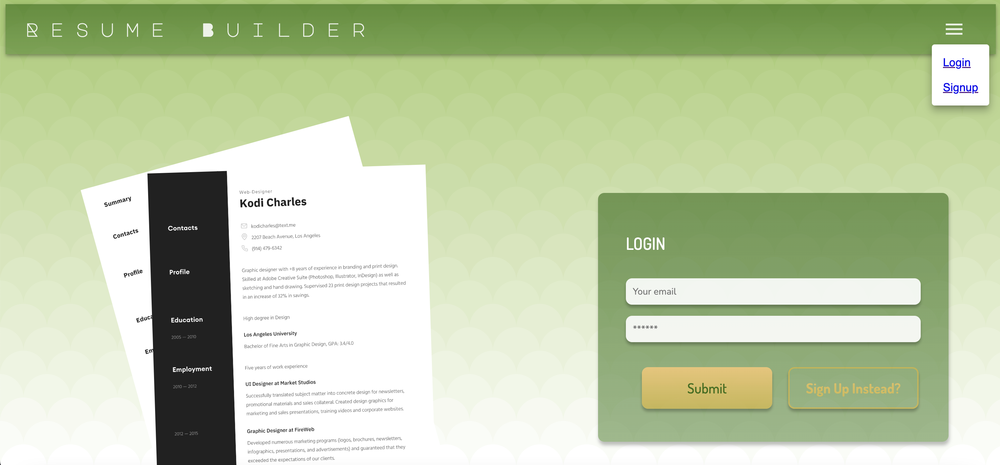
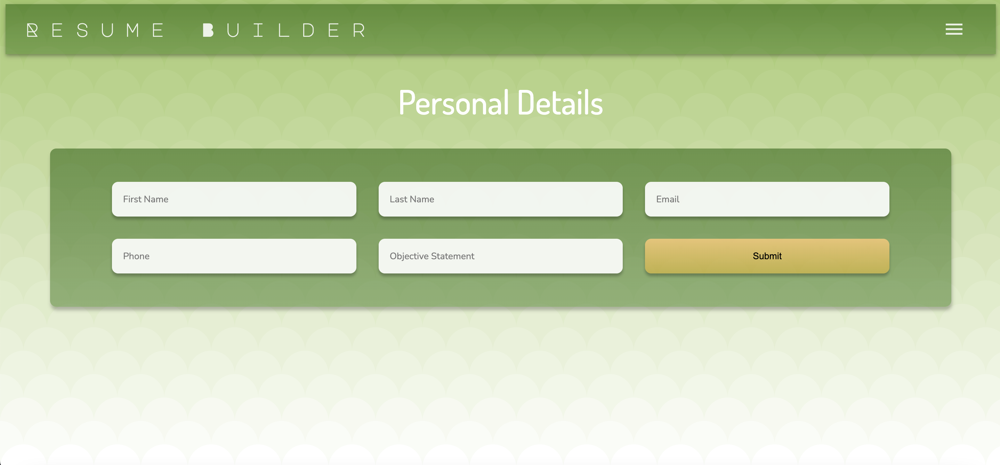
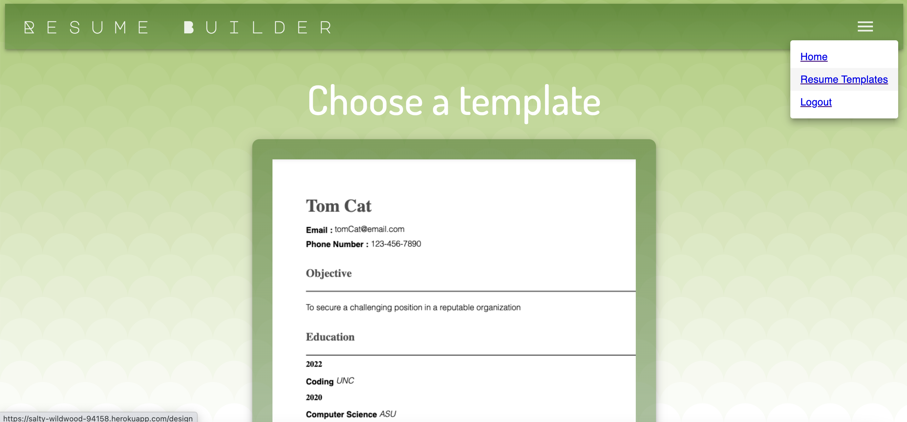
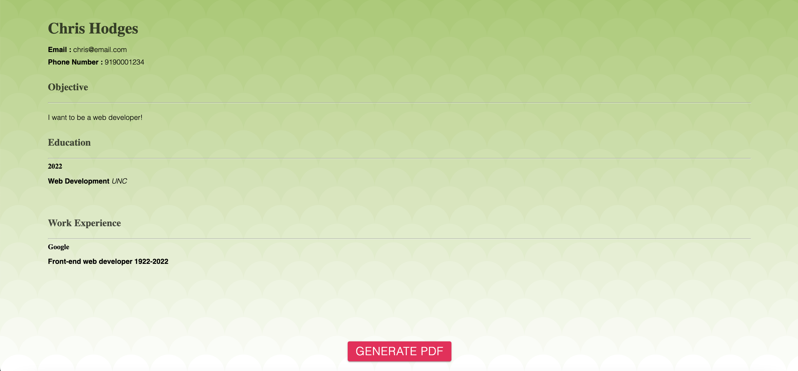
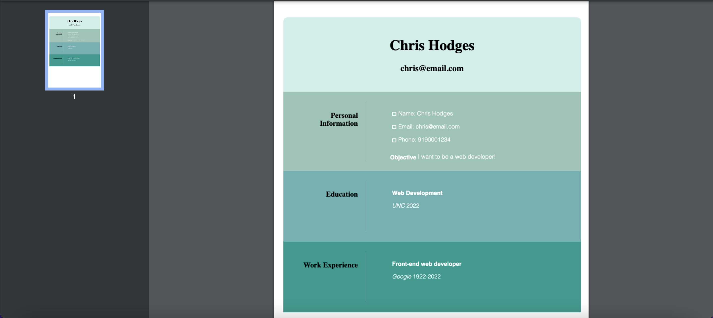

# Resume Builder

## Description
This collaborative project provides a user with a simple application to create a resume.  The user must login or signup, and then they are presented with a form to enter personal information, education, and work experience.  The data is then saved and formatted into a pre-made template.  A user can choose from multiple template styles and then download the resume as a PDF.

* This project was made useing the MERN stack (mongodDb, express.js, React, node.js).
* Other technologies include Apollo Server, graphQL, JSON Web Tokens, react-to-PDF, and materialUI.
* App deployed live with Heroku.

## Deployed Application
The app is deployed at https://salty-wildwood-94158.herokuapp.com/

## Installation
To access the application locally:

Install dependencies by running `npm i` in the root directory.

Use `npm run develop` to start the servers concurrently and view in the browser at `localhost:3001`

## Screenshot
Login

 

Enter information

 

Choose a template

 

View resume in browser

 

View PDF

 

## Contributions
Developed by:
* Chris Hodges @ https://github.com/chrisdhodges12
* Namitha Kamath @ https://github.com/nkamth
* Booker King @ https://github.com/btking1

## Questions
For any questions, contact me at chrisdhodges12@gmail.com or find us on GitHub.

* GitHub Repo: https://github.com/chrisdhodges12/resume-builder

